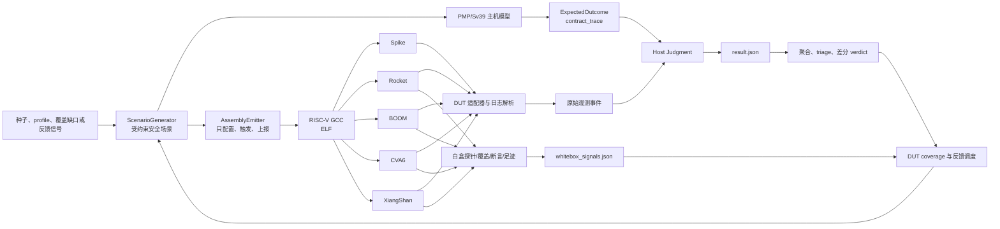
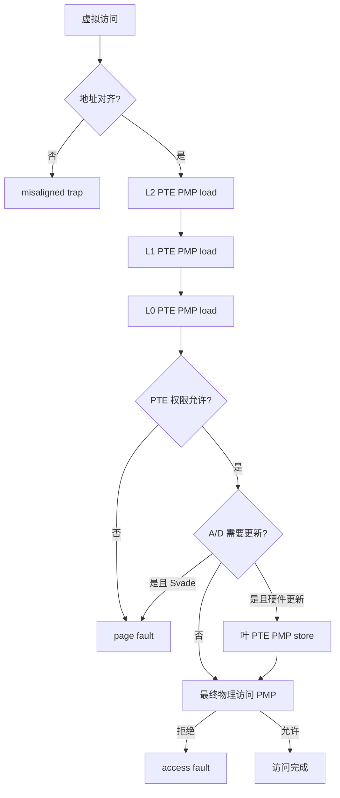

# PMPFuzz 详细设计说明

> 文档基线：`381550af54e3340621633bad6a0e887d0ac3272f` 及其后续仅文档性修改
>
> 适用对象：PMPFuzz 开发者、RISC-V 安全测试人员、RTL/芯片验证人员、论文作者与审计人员
>
> 文档性质：当前实现说明，不替代 RISC-V Privileged Architecture、Smepmp 或具体 DUT 的官方规范

## 1. 文档目的

PMPFuzz 是一个面向 RISC-V Physical Memory Protection（PMP）、Smepmp、特权级切换、Sv39 地址翻译以及页表遍历 PMP 检查的安全测试框架。它的核心不是“随机生成一些 PMP CSR 值然后看模拟器是否崩溃”，而是把一次安全测试拆成五个相互制约的部分：

1. 生成有明确安全语义的受约束场景；
2. 用独立的主机侧规范模型计算预期行为；
3. 将场景编译成只负责配置、触发和上报原始事件的 RISC-V 测试程序；
4. 在一个或多个 DUT 上运行并收集结构化黑盒或白盒证据；
5. 以 fail-closed 方式判定、复现、归类和确认潜在漏洞。

本说明详细回答以下问题：

- PMPFuzz 想检测什么安全问题；
- 黑盒和白盒测试分别依赖哪些可见信息；
- PMP、Smepmp、Sv39、A/D 位和异常优先级如何建模；
- 测试程序为何不再自带 oracle；
- DUT 原始事件如何编码、传输和判定；
- 为什么一次异常不能直接升级为漏洞；
- 白盒证据如何绑定到正确的 case、result 和 DUT；
- 覆盖率与反馈调度如何驱动下一轮测试；
- 当前实现仍有哪些边界和后续改进方向。

为避免混淆，本文使用下列状态标记：

- **已实现**：当前仓库中已有代码和单元测试支持；
- **条件支持**：只有在 DUT、日志、探针或运行环境提供足够能力时才成立；
- **规划方向**：设计上需要，但当前实现尚未闭环。

### 1.1 阅读路线

- 第 2～4 节给出核心思想、威胁模型和总体架构；
- 第 5～9 节解释场景、PMP/Sv39 oracle 与 profile 生成；
- 第 10～14 节解释汇编、观测协议、主机判定、DUT 和能力门控；
- 第 15～18 节分别说明黑盒、白盒、覆盖率和反馈调度；
- 第 19～23 节说明产物、triage、漏洞确认、复现与验证基线；
- 第 24～28 节总结安全原则、已知限制、证据映射和后续路线。

## 2. 一句话设计概括

PMPFuzz 的设计可以概括为：

> 以受约束安全场景为共同输入，以主机规范模型为预期结果来源，以 DUT 测试程序为原始事件采集器，以多 DUT 差分和白盒探针为补充证据，并以能力门控、证据完整性检查和独立重放为漏洞确认门槛。

它同时支持两种测试视角：

- **黑盒视角**只使用架构可见结果，例如完成、trap、`mcause`、`mtval` 指纹、`mepc` 标签、超时和退出标记；
- **白盒视角**额外使用 RTL/仿真器内部的 PMP、PTW、TLB、异常仲裁、性能计数器、断言和内存访问足迹。

这两个视角不是相互替代关系。黑盒路径回答“DUT 的架构行为是否符合安全契约”，白盒路径回答“错误发生在安全链的哪个内部阶段，以及哪些内部路径尚未覆盖”。

## 3. 安全问题与测试对象

### 3.1 受保护资产

PMPFuzz 关注的资产不是某个固定内存地址本身，而是由 RISC-V 特权架构建立的隔离语义：

- M/S/U 特权域之间的物理内存隔离；
- PMP 低编号优先和全访问范围匹配语义；
- PMP 的读、写、执行权限；
- `mstatus.MPRV/MPP` 对数据访问有效特权级的影响；
- Smepmp 的 `MML`、`MMWP`、`RLB` 规则；
- Sv39 页表权限与 PMP 权限的组合；
- 页表遍历自身的 PMP 保护；
- 硬件更新 PTE A/D 位时的隐式写权限；
- PMP/PTE 更新之后 TLB、ITLB、DTLB 或 PTW 缓存不得继续使用过期权限；
- 被拒绝的 store 不得产生内存副作用；
- 异常必须具有正确的种类、地址、执行位置和内部阶段；
- 乱序、重放和异常仲裁不得造成挂死或丢失精确异常。

### 3.2 可检测的缺陷类别

当前场景、oracle 和判定链主要用于检测以下缺陷：

| 缺陷类别 | 安全表现 | 典型观测 |
| --- | --- | --- |
| 权限绕过 | 预期应 trap 的 load/store/fetch 完成 | `unexpected_no_trap` |
| 错误拒绝 | 预期允许的访问发生 trap | `unexpected_trap` |
| first-match 错误 | 访问落入低编号项后错误回退到高编号项 | 错误完成或错误 `match_index` 白盒证据 |
| 部分重叠错误 | 低编号项仅覆盖访问的一部分，却被错误忽略 | 错误允许或错误异常 |
| 异常类型错误 | access fault 被报告成 page fault 等 | `wrong_mcause` |
| 异常地址错误 | trap 原因接近但不是同一故障地址 | `wrong_mtval` |
| 异常路径错误 | setup、warmup、final 或其他路径被误当成 probe | `wrong_path` |
| 异常位置错误 | `mepc` 不在活动探针窗口 | `wrong_mepc` |
| PTW 阶段错误 | 相同 `mcause` 实际来自错误 PTW 层级或最终访问 | `wrong_trap_stage` |
| 非法副作用 | 被拒绝 store 修改了 sentinel | `forbidden_side_effect` |
| 缺失副作用 | 被允许 store 未修改 sentinel | `missing_expected_side_effect` |
| 过期权限复用 | PMP/PTE 更新并执行要求的 fence 后仍使用旧权限 | stale permission 类失败 |
| 活锁或死锁 | DUT 未完成也未产生精确异常 | `pipeline_hung` 或 `timeout` |
| RTL 内部故障 | 安全相关断言失败 | `rtl_assertion` / `sim_assert` |

### 3.3 当前威胁模型

PMPFuzz 的测试者被假定能够：

- 为 DUT 装载或运行一个裸机 RISC-V ELF；
- 在测试开始时配置 M-mode CSR；
- 切换到 M、S 或 U 模式执行探针；
- 通过 `tohost`、仿真器 MMIO、XiangShan good/bad trap 或适配后的等价通道取得完成结果；
- 对白盒目标编译带探针的 RTL/仿真器，并访问运行日志或覆盖产物；
- 对候选用例在多个 DUT 或参考实现上进行独立重放。

测试程序本身运行在受控实验环境中。它可以配置 PMP、页表和特权 CSR，但不会假定攻击者在部署系统中天然拥有相同权限。PMPFuzz 的目标是验证硬件安全机制是否正确实现，而不是声称普通 U-mode 攻击者可以直接写这些 CSR。

### 3.4 明确不在当前范围内的内容

当前实现不宣称覆盖以下问题：

- 功耗、电磁、时钟、故障注入等物理侧信道；
- 缓存时序、分支预测器、投机执行泄露等一般微架构侧信道；
- 多核一致性、多 hart PMP 更新可见性和跨核 TLB shootdown；
- Hypervisor 两阶段翻译、Sv48/Sv57、PBMT、NAPOT PTE 等完整 MMU 特性；
- IOMMU、DMA、外设总线主设备对 PMP 或系统防火墙的交互；
- 任意厂商板卡的烧录、复位、串口/JTAG 采集和断电恢复；
- 形式化完备性证明；
- 自动漏洞利用或攻击载荷生成。

## 4. 总体架构



### 4.1 主要模块

| 模块 | 责任 | 关键输出 |
| --- | --- | --- |
| `scenario.py` | 生成确定、可复现、带安全语义的场景 | `PmpScenario` |
| `pmp.py` | 建模 PMP/Smepmp 匹配与权限 | `PmpDecision` |
| `mmu.py` | 建模 Sv39、PTE 权限、PTW PMP 与 A/D 更新 | `TranslationResult` |
| `oracle.py` | 将模型结果映射为架构结果和契约轨迹 | `ExpectedOutcome`、`contract_trace` |
| `schema.py` | 固化 case/result 数据模型 | `case.json`、`result.json` |
| `emitter.py` | 生成与 oracle 解耦的 RISC-V 汇编 | `.S` |
| `dut.py` | 运行 Spike/RTL 仿真器并解析原始结果 | `DutRunResult` |
| `judgment.py` | 将 DUT 原始事件与预期契约独立比较 | `ObservationJudgment` |
| `runner.py` | 编译、调度、超时、产物与活动预算管理 | run 目录 |
| `capabilities.py` | 判断 DUT 是否适用于某个 oracle | capability matrix |
| `verdict.py` | 多 DUT 差分与漏洞确认门控 | security verdict |
| `triage.py` | 失败去重、报告和复现命令 | triage/report |
| `semantic_coverage.py` | 语义、组合和契约谓词覆盖 | coverage gap/schedule |
| `source_probe.py` | 发现和生成源码探针补丁 | manifest/patches |
| `whitebox.py` | 从每个 result 自有产物提取安全信号 | whitebox signals |
| `dut_coverage.py` | 构建 DUT 白盒覆盖和跨 DUT 矩阵 | DUT coverage |
| `feedback.py` | 根据黑盒失败和白盒信号选择邻域用例 | feedback schedule |

### 4.2 可信边界

PMPFuzz 不把所有组件都视为同一个“正确源”。其可信关系如下：

1. `PmpScenario` 是测试意图的共同输入；
2. oracle 从场景计算“应该发生什么”；
3. emitter 从场景生成“实际做什么”，但不得读取 oracle 的判定结果；
4. DUT 只返回“实际发生什么”；
5. host judgment 在运行后比较预期与实际；
6. 白盒探针只能补强阶段证据，不能单独覆盖架构判定；
7. security verdict 还要求能力有效性和独立重放元数据。

这套边界的目标是降低“同一错误逻辑同时写进测试程序和 oracle，导致假通过”的风险。

## 5. 场景数据模型

### 5.1 `PmpScenario`

一个场景包含以下核心维度：

- `entries`：PMP 表项列表；
- `privilege`：实际执行探针的 M/S/U 特权级；
- `probe`：load/store/fetch、物理地址、虚拟地址、访问大小和边界位置；
- `mprv`、`mpp`：M-mode 数据访问的有效特权级条件；
- `mseccfg`：`MML/MMWP/RLB`；
- `translation`：Bare 或 Sv39；
- `sv39`：虚实映射、三级页表地址和叶 PTE；
- `sum_enabled`、`mxr`：S-mode 页权限控制；
- `sfence_vma`：是否执行地址翻译 fence；
- `ad_update_mode`：Svade 或硬件 A/D 更新；
- `ptw_fault_level`、`preload_mode`：PTW 故障层级和缓存预热方式；
- `stateful_sequence`：warmup、权限变更、fence、最终探针和 sentinel 预期；
- `coverage_tags`、`security_focus`、`smepmp_rule`：覆盖和报告元数据。

场景对象是不可变 dataclass。固定 `seed + profile + index` 时，生成结果可复现。多 profile 运行会把 profile 名加入 case 名，避免同一 run 目录中的 `scenario_0000` 相互覆盖。

### 5.2 固定实验内存布局

当前 emitter 使用固定的 RV64 裸机布局：

| 区域 | 基址 | 大小 | 用途 |
| --- | ---: | ---: | --- |
| M text | `0x80000000` | `0x2000` | 启动、trap handler、M-mode 控制流 |
| M data | `0x80002000` | `0x2000` | stack、result、tohost、phase |
| S/U code | `0x80004000` | `0x1000` | 低特权探针代码 |
| target | `0x80008000` | `0x1000` | 被测 load/store/fetch 与 sentinel |
| page table | `0x80010000` | `0x8000` | Sv39 根表、L1、L0 页表 |
| target VA | `0x80000000` | 4 KiB 页面 | 指向 target 物理页 |
| probe VA | `0x40000000` | 4 KiB 页面 | 指向 S/U 探针代码 |

固定布局使 `mepc` 窗口、PMP harness 表项和页表遍历地址都可预测。代价是当前程序不是位置无关的，也不能直接适配任意 SoC 内存图；真实板卡适配器需要将这些区域参数化。

### 5.3 harness 与被测区域隔离

测试程序本身也受 PMP 约束。如果没有为 M-mode handler、data、S/U probe code 建立安全的 harness 区域，DUT 可能在进入真正探针前就发生 trap，形成“setup trap 被误认成目标 trap”。

因此生成器会保留低编号表项给 harness：

- M text：可读、可执行、锁定；
- M data：可读、可写、锁定；
- S/U code：可读、可执行；
- 被测 target 或 page-table 表项使用后续编号。

phase 字段和 `mepc` 窗口检查进一步防止 harness 故障伪装成目标结果。

## 6. PMP 规范模型

### 6.1 地址模式

当前 `PmpModel` 支持：

- `OFF`：不参与匹配；
- `TOR`：下界来自前一个编号表项的 `pmpaddr << 2`，上界来自当前项；
- `NA4`：覆盖 `pmpaddr << 2` 开始的 4 字节；
- `NAPOT`：根据 `pmpaddr` 末尾连续 1 的个数恢复自然对齐的 2 的幂区域。

NAPOT 生成器要求：

- size 至少 8 字节；
- size 是 2 的幂；
- base 按 size 自然对齐。

### 6.2 first-match 的精确定义

一次访问由半开区间表示：

```text
access = [physical_address, physical_address + size)
entry  = [lower, upper)
```

PMP 的选择分成两个步骤：

1. 按编号从低到高寻找与访问任意字节相交的第一个活动表项；
2. 检查该表项是否完整包含访问的所有字节。

相交条件是：

```text
lower < access_upper && physical_address < upper
```

完整包含条件是：

```text
lower <= physical_address && access_upper <= upper
```

如果低编号表项只覆盖访问的一部分，模型立即拒绝，不能继续寻找后续更宽的允许表项。这一点对跨边界 load/store 和 overlapping region 特别重要。

### 6.3 有效特权级

默认情况下，有效特权级就是执行访问的特权级。唯一例外是：

- 当前执行在 M-mode；
- `MPRV=1`；
- 访问类型是 load 或 store；
- 此时使用 `MPP` 作为 PMP 检查的有效特权级。

instruction fetch 不受 MPRV 改写，仍按实际特权级检查。

### 6.4 未匹配访问

在当前模型中：

- M-mode 且 `MMWP=0`：未匹配访问允许；
- M-mode 且 `MMWP=1`：未匹配访问拒绝；
- S/U-mode：未匹配访问默认拒绝。

### 6.5 非 Smepmp 权限

当 `MML=0` 时：

- `W=1,R=0` 被视为保留编码并拒绝；
- 未锁定 PMP 项对 M-mode 不施加普通 R/W/X 限制；
- 锁定项对 M-mode 生效；
- S/U-mode 按 R/W/X 权限位检查。

### 6.6 当前 Smepmp MML 权限表

`MML=1` 时，`L/R/W/X` 组合会改变表项归属和权限含义。当前实现显式编码了下列规则族：

| L | R | W | X | 当前模型语义摘要 |
| ---: | ---: | ---: | ---: | --- |
| 0 | 0 | 1 | 1 | shared data，load/store 可用 |
| 0 | 0 | 1 | 0 | M 可 load/store，S/U 只 load |
| 0 | 其他 | 其他 | 其他 | M 拒绝，S/U 按权限位 |
| 1 | 0 | 1 | 0 | shared code，fetch 可用 |
| 1 | 0 | 1 | 1 | M 可 load/fetch，S/U 仅 fetch |
| 1 | 1 | 1 | 1 | 只允许 load |
| 1 | 其他 | 其他 | 其他 | S/U 拒绝，M 按权限位 |

该表是当前 PMPFuzz 支持的 Smepmp 子集，不应被解释为对所有 WARL、锁定转换和实现相关行为的完整形式化规范。PMPFuzz 通过 capability probe 和 `oracle_applicability` 避免在 DUT 不支持相同规则时强行下结论。

## 7. Sv39 与 A/D 位模型

### 7.1 翻译检查顺序

对一个 Sv39 探针，`Sv39Model` 按以下顺序执行：

1. 查找覆盖整个访问范围的 4 KiB 映射；
2. 依次对 L2、L1、L0 页表项地址执行 S-mode、8 字节 PMP load 检查；
3. 检查叶 PTE 的有效性和 R/W/X/U/SUM/MXR 语义；
4. 检查 A/D 位是否需要更新；
5. 若使用硬件 A/D 更新，对叶 PTE 地址执行 S-mode、8 字节 PMP store 检查；
6. 计算最终物理地址；
7. 对最终 load/store/fetch 执行 PMP 检查。



### 7.2 PTE 权限

当前模型执行以下检查：

- `V=0`：page fault；
- `W=1,R=0`：保留编码，page fault；
- store 要求 `W=1`；
- U-mode 要求 `U=1`；
- S-mode 访问 U 页面：fetch 始终拒绝，data access 需要 `SUM=1`；
- load 要求 `R=1`，或 `MXR=1` 且 `X=1`；
- fetch 要求 `X=1`。

SUM 和 MXR 只修改页表权限，不改变 PMP R/W/X 权限。

### 7.3 Svade 模式

当 `ad_update_mode=svade` 时：

- `A=0` 的访问产生 page fault；
- store 且 `D=0` 产生 page fault；
- 模型不尝试修改叶 PTE。

### 7.4 硬件 A/D 更新模式

当 `ad_update_mode=hardware` 时：

- 若需要设置 A 或 D，硬件被建模为对叶 PTE 地址执行一次隐式 S-mode store；
- 该 store 也必须经过 PMP；
- 如果 PMP 拒绝叶 PTE 写入，结果是 page-table-walk 阶段的 access fault；
- 如果允许，模型继续最终物理访问，并在结果中记录 `ad_updated=True`。

这一步防止把“PTW 读页表允许”错误等同于“硬件可以更新 A/D 位”。

### 7.5 异常优先级

当前 oracle 首先检查自然对齐，因此地址不对齐优先于 PMP/PTE 权限错误。随后：

- PTW PMP 拒绝映射为原始访问类型的 access fault；
- PTE 权限或 Svade A/D 缺失映射为原始访问类型的 page fault；
- 最终物理 PMP 拒绝映射为原始访问类型的 access fault。

例如，U-mode load 的 L1 PTE 读取被 PMP 拒绝时，架构 `mcause` 应为 load access fault，而不是 load page fault；但白盒阶段仍应指明这是 L1 PTW 故障。

## 8. Oracle 与安全契约

### 8.1 `ExpectedOutcome`

oracle 的最终结果包含：

- `allowed`：访问应否完成；
- `trap_cause`：预期异常原因；
- `stage`：`address_misaligned`、`pmp`、`page_table_walk`、`pte_permission`、`final_access`、`none` 或 `stateful_final`；
- `reason`：可读的模型判定原因；
- `physical_address`：适用时的最终物理地址。

### 8.2 `contract_trace`

单一的 allowed/cause 不足以解释安全链，因此每个 case 还保存逐阶段契约轨迹：

- 执行 privilege、access、translation mode；
- 有效特权级；
- trap priority；
- 每次 PMP 检查的 stage、访问类型、地址、大小、匹配项、匹配模式和允许结果；
- PTW 检查的 L2/L1/L0 层级；
- PTE decision；
- A/D 更新的隐式 PTE store；
- final access；
- store side-effect policy；
- stateful warmup/mutation/fence/final 元数据。

`contract_trace` 有三个作用：

1. 为人工审计提供可解释的预期路径；
2. 为 host judgment 提供 PTW 层级和故障地址；
3. 生成与 profile 名无关的 contract predicate coverage。

### 8.3 oracle 的独立性边界

当前独立性是“判定逻辑独立”，不是“整个工具链由完全不同团队和语言实现”：

- `oracle.py` 调用 `PmpModel/Sv39Model` 计算预期；
- `emitter.py` 不导入 `evaluate_scenario`，也不把 expected allowed/cause 嵌入测试程序；
- 测试程序只标记执行 phase，读取真实 CSR，并上报 trap 或 completion；
- `judgment.py` 在主机侧读取 case 的 expected/contract trace 后再比较。

仍然存在共同依赖：scenario、地址布局、生成器和 case 重建代码都在同一仓库中。因此高置信漏洞确认还要求独立重放器、多个 DUT 或额外规范实现，不能仅凭同一进程内的一个 oracle 得出最终结论。

## 9. 测试场景生成策略

### 9.1 基本原则

PMPFuzz 当前使用“确定性受约束枚举 + 覆盖引导选择”，而不是字节流变异式 fuzzer。这样做是因为 PMP 安全问题高度依赖合法配置顺序、特权级、地址边界、页表结构和缓存状态。无约束随机 CSR 写入会产生大量 setup 失败和无意义样本。

生成器通过 `index` 系统性展开权限、特权级、地址模式、边界、PTE 和预热状态；随机数主要用于某些合法内部地址，但由 seed 固定。

### 9.2 profile 目录

#### 9.2.1 基础 PMP

| Profile | 目的 | 主要维度 |
| --- | --- | --- |
| `legacy` | 基础 PMP load/store/fetch | TOR/NAPOT、M/S/U、MPRV、锁定、边界 |
| `legacy-data` | 稳定数据访问基线 | load/store、TOR/NAPOT、M/S/U |
| `legacy-fetch-experimental` | 早期 fetch 路径 | fetch 边界，标记 experimental |
| `pmp-boundary` | 精确边界与 first-match | TOR/NA4/NAPOT、upper bound、last byte、overlap、锁定、M/S/U |

`pmp-boundary` 的目标空间当前按 144 个候选展开，用于覆盖访问类型、特权级、锁定位、允许/拒绝和边界组合。

#### 9.2.2 Smepmp

| Profile | 目的 |
| --- | --- |
| `smepmp-table` | 遍历 16 种 L/R/W/X 编码以及 M/S/U 和访问类型 |
| `smepmp-mmwp-mmode-default-deny` | 验证 MMWP 对未匹配 M-mode 访问的默认拒绝 |
| `smepmp-mml-shared-code` | 验证 MML shared-code 规则 |
| `smepmp-mml-shared-data` | 验证 MML shared-data 规则 |
| `smepmp-locked-entry` | 验证锁定项在不同特权级下的权限 |
| `smepmp-rlb-setup` | 验证需要 RLB 的锁定表项设置路径 |

稳定 Smepmp profile 被纳入 `core-stateful` 目标；`smepmp-table` 仍作为 experimental 扩展空间。运行前应探测 DUT 的 `mseccfg`、RLB 和 WARL 行为。

#### 9.2.3 Sv39 与 PTW

| Profile | 目的 | 主要维度 |
| --- | --- | --- |
| `sv39-final-pmp` | 翻译成功后检查最终物理 PMP | S/U、load/store/fetch、PTE、final PMP |
| `sv39-ptw-pmp` | 页表遍历地址被 PMP 拒绝 | walk 地址与 access fault |
| `sv39-perm-matrix` | PTE 权限矩阵 | R/W/X/U/A/D/V、SUM、MXR、S/U |
| `sv39-ptw-pmp-matrix` | 系统展开 PTW PMP | L2/L1/L0、preload、锁定、S/U、访问类型 |
| `tlb-fence` | 比较执行与不执行 `sfence.vma` 的路径 | 翻译缓存行为 |

当前目标候选数中，`sv39-perm-matrix` 为 168，`sv39-ptw-pmp-matrix` 为 288。

#### 9.2.4 有状态权限与副作用

| Profile | warmup | mutation | fence | 安全目标 |
| --- | --- | --- | --- | --- |
| `pmp-side-effect` | 可选/控制 | PMP store allow/deny | 适用时 fence | 被拒绝 store 不修改 sentinel |
| `tlb-stale-pte` | 建立翻译 | 叶 PTE 改为 deny | `sfence.vma` | 不复用旧 PTE 权限 |
| `tlb-stale-pmp` | 建立翻译/访问 | final-target PMP 改为 deny | `sfence.vma` | 不复用旧最终权限 |
| `ptw-stale-pmp` | 预热 PTW | 页表页 PMP 改为 deny | `sfence.vma` | 不复用旧 PTW 权限 |

stateful case 的核心不是一次访问，而是以下序列：

```text
初始化 sentinel
-> warmup probe
-> 通过 ecall 返回 M-mode
-> 修改 PTE/PMP
-> 执行要求的 fence
-> final probe
-> 读取 sentinel
-> 上报 final trap/completion + sentinel phase
```

#### 9.2.5 BOOM 回归

`boom-ptw-pmp-regression` 固定生成已知高风险 PTW/PMP 组合及其控制样本，覆盖 U-mode Sv39 load、L1 PTW deny、cold preload、MXR 等条件。它用于回归和差分定位，不代表只针对 BOOM 才有意义。

#### 9.2.6 XiangShan 定向场景

| Profile | 重点 |
| --- | --- |
| `xiangshan-fetch-pmp-boundary` | fetch 边界与特权切换 |
| `xiangshan-itlb-stale-pmp` | PMP 更新后的 ITLB 权限 |
| `xiangshan-ptw-pmp-depth` | PTW 层级、预热与 fetch/load/store |
| `xiangshan-side-effect` | denied store 与 sentinel |

这些 profile 与 XiangShan 源码探针、性能计数器和 commit trace 组合使用，但也可先在 Spike/Rocket 上建立控制基线。

#### 9.2.7 通用乱序微架构场景

| Profile | 重点风险 |
| --- | --- |
| `ooo-fetch-replay-pmp` | fetch replay 与 PMP 边界 |
| `ooo-itlb-stale-after-pmp-update` | PMP 更新后的 ITLB stale permission |
| `ooo-dtlb-stale-after-pmp-update` | load/store DTLB stale permission |
| `ooo-ptw-replay-pmp-deny` | PTW replay、refill、PMP deny 和挂死 |
| `ooo-exception-priority` | page fault/access fault/无效 PTE 仲裁 |
| `ooo-misaligned-page-cross-pmp` | 不对齐、跨页与 PMP 边界优先级 |
| `ooo-ad-bit-side-effect` | Svade/硬件 A/D 更新及 PTE 写权限 |
| `ooo-fence-race-matrix` | `sfence.vma`、`fence.i` 与实验性 no-fence |

其中 `no-fence-experimental` 结果只作为实验观察，不直接升级为漏洞，因为规范可能允许实现继续使用缓存状态。

## 10. 汇编测试程序设计

### 10.1 三种程序骨架

`AssemblyEmitter` 根据场景选择：

- legacy skeleton：基础 Bare PMP；
- structured skeleton：Sv39、Smepmp 和定向场景；
- stateful skeleton：warmup/mutation/final 序列。

三种骨架共同遵循：

1. 禁用 RVC 和 linker relax，稳定指令地址；
2. 初始化 stack 和 M-mode trap handler；
3. 清除 delegation，保证 trap 回到 M-mode；
4. 配置 PMP/mseccfg；
5. 适用时建立页表、写 `satp`、执行 `sfence.vma`；
6. 配置 `mstatus.MPP/MPRV/SUM/MXR`；
7. 标记 phase；
8. 用 `mret` 进入目标特权级和探针；
9. trap handler 读取真实 CSR；
10. 将原始事件写入 result 并通过后端完成协议上报。

### 10.2 PMP 配置顺序

普通 PMP 场景先写 `pmpaddr`，再写 `pmpcfg0`，最后写 `mseccfg`。

MML 场景需要考虑 `W=1,R=0` 在启用前后的含义，因此 emitter 将表项分为：

- 启用 MML 前可安全写入的表项；
- 启用 MML 后才写入的 shared encoding 表项。

这避免 setup 阶段因保留编码或锁定语义而提前失败。

### 10.3 探针形式

- load：`lw` 或 `ld`；
- store：写入固定值 `0x5a5a5a5a`；
- fetch：`jalr` 到目标地址；
- 正常完成：写入 completed phase，然后以固定 `a0=0x51` 执行 ecall；
- stateful final：通过 sentinel 当前值区分未修改、按预期修改和未知值。

### 10.4 trap handler 原始记录

handler 读取并保存：

| result 偏移 | 字段 |
| ---: | --- |
| 0 | `mcause` |
| 8 | `mtval` |
| 16 | `mepc` |
| 24 | `mstatus` |
| 32 | 编码后的传输值 |

完整 CSR 值留在 ELF 的 `result` 内存区域，供调试器、内存 dump 或定制仿真器读取。普通 `tohost` 日志使用压缩观测协议，不能代替完整 CSR dump。

### 10.5 emitter 不做判定

测试程序不会执行如下逻辑：

```text
if mcause == expected_cause:
    pass
else:
    fail
```

它只判断某次 ecall 是否表示“探针代码已经完成”，以便将事件种类标记为 completion；真正的“completion 是否符合预期”由主机完成。除这项协议分类外，汇编不读取 `expected.allowed`、`expected.trap_cause` 或 oracle stage。

## 11. 原始观测协议

### 11.1 设计目标

协议需要在 Spike/HTIF 的退出约束下传输足以阻止常见假通过的信息，同时保持值为安全的非负小整数。当前 payload 使用 30 位：

| 位段 | 字段 | 宽度 | 含义 |
| --- | --- | ---: | --- |
| 29 | version | 1 | 当前为 1 |
| 28 | kind | 1 | trap 或 completion |
| 27:25 | phase | 3 | setup/probe/completed/warmup/final/sentinel 状态 |
| 24:21 | `mcause` | 4 | 当前同步异常原因低 4 位 |
| 20:17 | `mepc` tag | 4 | `(mepc >> 12) & 0xf` |
| 16:0 | `mtval` fingerprint | 17 | 64 位地址按 17 位分组异或折叠 |

传输到传统 `tohost` 时，汇编再执行：

```text
transport = (payload << 1) | 1
```

不同适配器根据自身日志语义恢复 payload。Cascade 和 XiangShan 结构化路径会显式处理奇数 transport；Spike/Chipyard 解析器按其失败日志报告格式取得值。

### 11.2 phase 定义

| Phase | 语义 |
| --- | --- |
| `SETUP` | 尚未进入目标探针的配置路径 |
| `PROBE` | 单阶段目标访问 |
| `COMPLETED` | 探针完成后的 ecall |
| `WARMUP` | stateful 预热访问 |
| `FINAL` | stateful 最终访问，尚未分类 sentinel |
| `FINAL_SENTINEL_INITIAL` | sentinel 保持初值 |
| `FINAL_SENTINEL_MODIFIED` | sentinel 等于测试 store 值 |
| `FINAL_SENTINEL_OTHER` | sentinel 为未知值 |

### 11.3 指纹的作用与边界

`mtval` 指纹和 `mepc` page tag 用于拒绝“cause 相同但地址或代码路径明显不同”的事件。它们不是密码学摘要，也不是完整地址：

- 17 位 `mtval` 指纹存在碰撞可能；
- 4 位 `mepc` tag 只区分有限页面窗口；
- `mcause` 只有 4 位，当前覆盖的同步异常均在该范围内。

因此高置信确认应保留完整 CSR dump、源码探针地址或独立 trace。协议的设计目标是显著减少假通过，而不是把 30 位 payload 当成不可伪造证明。

## 12. 主机侧判定

### 12.1 completion 判定

当 DUT 上报 completion 时，host judgment 检查：

1. phase 必须是 `COMPLETED`，stateful final 也可使用 sentinel phase；
2. `mcause` 必须是当前特权级对应的 ecall cause：U=8、S=9、M=11；
3. `mtval` 指纹必须对应 0；
4. `mepc` tag 必须位于活动 probe 窗口；
5. oracle 必须预期允许，或 stateful sentinel 必须符合最终契约。

如果 oracle 预期 trap，但 probe 完成，则产生 `unexpected_no_trap`。

### 12.2 trap 判定

当 DUT 上报 trap 时，检查顺序为：

1. kind 必须是已知 trap；
2. phase 必须是 `PROBE` 或合法 final phase；
3. oracle 不能预期允许；
4. `mcause` 必须相同；
5. `mtval` 指纹必须匹配 case 的有效访问地址；
6. `mepc` 必须位于 probe 窗口；
7. 若预期 stage 是 PTW，还必须有白盒 stage/address 证据；
8. stateful case 还要检查 sentinel。

### 12.3 PTW stage 证据

相同的 load access fault 可能来自：

- 读取 L2/L1/L0 PTE 被 PMP 拒绝；
- 硬件 A/D 更新叶 PTE 的 store 被拒绝；
- 翻译后的最终物理 load 被 PMP 拒绝；
- 甚至与目标无关的 setup 路径。

因此 PTW case 不能只靠 `mcause=5` 通过。host judgment 从 `PMFUZZ_PROBE` 日志中提取：

- `stage`；
- `level`；
- `paddr` 或 `addr`。

如果缺少 stage 或 fault address，结果是：

```text
status = inconclusive
failure_class = unverified_trap_stage
```

如果证据存在但层级、阶段或地址不一致，则是 `wrong_trap_stage`。只有 stage 与地址相符时，`stage_verified=True`。

### 12.4 stateful side-effect 判定

- 预期 store side effect：phase 必须是 `FINAL_SENTINEL_MODIFIED`；
- 预期 trap 且无 side effect：phase 必须是 `FINAL_SENTINEL_INITIAL`；
- `FINAL_SENTINEL_OTHER` 表示未知内存状态，不能通过。

这使“trap 正确但 store 已经部分提交”的安全问题不会被仅凭 `mcause` 掩盖。

## 13. DUT 适配层

### 13.1 支持的后端

| DUT 名称 | 运行方式 | 完成协议 | 诊断深度 |
| --- | --- | --- | --- |
| `spike` | 直接运行 Spike | tohost | structured tohost |
| `rocket-clean` | Chipyard make | tohost | structured tohost |
| `boom-clean` | Chipyard make | tohost | structured tohost |
| `cva6` / `cva6-clean` | 直接 Chipyard Verilator binary | tohost | structured tohost |
| `xiangshan-clean` | OpenXiangShan emu | xstrap good/bad trap；可选结构化日志 | 默认 pass/fail only |
| `rocket-cascade` | Cascade wrapper | MMIO stop/result | result code only |

`rocket` 是兼容旧环境的 make 后端；实验应优先使用 clean DUT 路径，以减少外部 fuzzing wrapper 对证据的影响。

### 13.2 编译

每个 `.S` 通过 `scripts/build/compile_one.sh` 编译：

- `-nostdlib -nostartfiles`；
- 禁止 relax；
- text 基址 `0x80000000`；
- 输出独立 ELF。

编译失败被记录为 `compile_fail`，复制到 failures 目录，绝不转为 pass。

### 13.3 超时与进程清理

每个 DUT 运行都有 wall-clock timeout。POSIX 环境下模拟器在独立 process group 中运行；超时时先向进程组发送 SIGTERM，仍不退出再发送 SIGKILL。超时写入日志并产生 `timeout`。

该设计避免 Verilator 子进程遗留并污染后续用例，也避免“没有输出”被当作正常退出。

### 13.4 fail-closed 日志解析

Spike/Chipyard 只有在出现以下之一时才可形成有效结果：

- 可解码的结构化 observation；
- 明确 `*** PASSED ***` 标记；
- 明确失败标记；
- 非零返回码、assertion 或 timeout。

返回码为 0 但没有完成标记时：

```text
status = infra_failure
failure_class = missing_completion_marker
```

XiangShan 同样要求 structured diag、good trap、bad trap、cycle-limit 或可识别失败；空日志/未知退出为 `infra_unadapted`。

### 13.5 白盒日志开关

启用 `--whitebox-artifacts` 时：

- Chipyard make DUT 增加 `EXTRA_SIM_FLAGS=+verbose`；
- CVA6 direct command 把 `+verbose` 放在 `+permissive` 与 `+permissive-off` 之间；
- XiangShan 增加 `--dump-commit-trace`；
- run/repro 完成后自动写 whitebox signals 和 DUT coverage。

## 14. DUT 能力模型与 oracle 适用性

### 14.1 为什么需要能力门控

一个 DUT 的失败可能不是硬件 bug，而是：

- 根本不实现 Smepmp；
- 不支持某种 S/U 模式或 Sv39；
- A/D 更新策略与 case 假设不同；
- XiangShan binary 使用 `CONFIG_NO_DIFFTEST`，不支持所需 good-trap 协议；
- simulator/finish protocol 尚未适配。

因此每个 run 保存 `dut_capabilities.json`，每个 case/result 保存 `required_capabilities` 和 `oracle_applicability`。

### 14.2 适用性状态

| 状态 | 含义 | 是否可用于漏洞证据 |
| --- | --- | --- |
| `valid` | DUT 能力与 case 假设一致 | 可以，仍需确认门控 |
| `unsupported` | DUT 不实现必要能力 | 不可以 |
| `setup_unsupported` | 当前具体设置无法合法完成 | 不可以 |
| `infra_unadapted` | 运行/结束/日志协议未适配 | 不可以 |
| `capability_dependent` | 如 A/D 模式未知，存在多个合法 oracle | 不可以，结果为 inconclusive |
| `experimental` | 规范允许多种行为或测试尚在探索 | 只作观察 |

### 14.3 A/D 模式门控

若 PTE `A=0`，或 store 时 `D=0`，case 对 A/D 模式敏感。DUT capability 中的 `ad_update_mode` 为 unknown 时，即使结构化观测看似 pass/fail，也会降级为 `inconclusive`，避免把 Svade 和硬件更新两种合法实现混为一谈。

## 15. 黑盒测试设计

### 15.1 黑盒定义

PMPFuzz 中的“黑盒”指不读取 RTL 内部信号，仅依赖：

- ELF 是否完成；
- trap/completion 类型；
- 压缩的 `mcause/mtval/mepc/phase`；
- 返回码、超时和明确日志标记；
- stateful sentinel 的最终分类；
- 多 DUT 的结果差分。

Spike、Rocket、BOOM、CVA6 和 XiangShan 都可以作为黑盒执行目标，但它们的诊断深度不同。

### 15.2 黑盒可独立判定的场景

以下场景通常可以只靠结构化架构观测判定：

- Bare PMP load/store/fetch；
- PMP first-match 与边界；
- 预期允许/拒绝的普通访问；
- PTE permission page fault；
- final physical PMP access fault；
- stateful sentinel side effect；
- 在 phase/mepc/mtval 足够区分时的部分异常路径。

### 15.3 黑盒难以独立判定的场景

PTW PMP deny 的架构 `mcause` 与 final PMP deny 可能相同，因此没有内部阶段/地址证据时，当前设计返回 inconclusive，而不是用 profile 先验“猜测”异常来自 PTW。

真实硅片如果只能提供 pass/fail UART 字符而不能提供结构化 CSR，也只能用于较弱的差分或存活性测试。要达到与仿真器相同的证据强度，需要板级 adapter 提供：

- ELF 装载与复位；
- 结构化 observation 传输；
- 超时和电源恢复；
- 完整 CSR 或 trace 采集；
- case/result/DUT 唯一标识。

这些板级 adapter 当前尚未在仓库中实现。

## 16. 白盒测试设计

### 16.1 白盒安全链

白盒探针聚焦于以下内部链路：

```text
PMP CSR 状态
-> PMP checker 输入/first-match/allow
-> TLB/ITLB/DTLB permission
-> PTW request 和页表地址
-> PTW access exception/response
-> page fault 与 access fault 仲裁
-> pipeline trap/commit/side effect
```

探针不追求通用 RTL line/toggle coverage 的最大化，而是优先覆盖能解释安全判定的内部状态。

### 16.2 源码探针发现

`source_probe.py` 为 XiangShan、Rocket、BOOM 和 CVA6 定义：

- probe id；
- security chain；
- 候选源码路径；
- anchor pattern；
- 期望信号字段；
- instrumentation hint。

`probe-source` 只发现源码和 anchor，不修改 DUT。输出 manifest 会区分：

- `source_found`；
- `pattern_missing`；
- `source_missing`；
- `root_missing`。

### 16.3 探针补丁生成

`source-probe-instrument` 读取原始源码，在内存中插入 `PMFUZZ_PROBE` 输出，生成 unified diff 和 apply 脚本。它不会直接修改 DUT 源树。这样做有三个好处：

1. 原始 DUT 保持可审计；
2. 探针补丁可以单独版本化和 A/B 构建；
3. 插桩失败会以 `unsupported_template` 或 `anchor_missing` 显式出现。

### 16.4 当前默认探针方向

- XiangShan：PMP checker、L1 TLB exception、L2TLB/PTW request、PMP CSR；
- BOOM：LSU TLB PMP checker、PTW response `ae_final`、`ptw_ae_array`、PTW request；
- Rocket：PMP checker、PTW access exception、TLB exception arbitration、TLB permissions；
- CVA6：PMP CSR、PTW exception、TLB exception arbitration。

### 16.5 白盒信号来源

`whitebox.py` 可从每个 result 自有目录中提取：

| 信号 | 来源 | 用途 |
| --- | --- | --- |
| `source_probe` | `PMFUZZ_PROBE` | 精确 stage/level/address/allow/match |
| `security_coverage_point` | `COVERAGE:` | 安全相关覆盖点 |
| `security_perf_counter` | XiangShan `[PERF]` 等 | PTW/TLB/trap 活动 |
| `rtl_assertion` | Verilator `%Error: ... Assertion failed` | 内部安全故障 |
| `trap_commit_trace` | commit/trace | trap 到达提交路径 |
| `ptw_pmp_footprint` | memory footprint | 页表地址是否实际访问 |
| `final_pmp_footprint` | memory footprint | 最终目标地址是否访问 |
| `forbidden_side_effect_footprint` | memory footprint | denied store 的可疑副作用 |

只有 `covered > 0` 的 `COVERAGE:` 记录才生成覆盖信号，声明存在但从未命中的点不算 covered。

### 16.6 白盒证据归属

每个 `result.json` 的父目录被记录为 `_artifact_root`。提取器只扫描该 result 自己的 `.log/.trace/.commit/.coverage/.cov/.footprint`。如果显式提供外部 artifact root，则只接受：

```text
artifact_root/<case>/<dut>/
artifact_root/<dut>/<case>/
```

只有单一 result 时才兼容 `artifact_root/<case>/`。

源码探针日志里可能包含静态 `dut=rocket-clean` 标签，即使同一 Rocket-Chip 代码被 BOOM 复用。当前归属规则是：

- 以 `result.dut` 作为权威 DUT；
- 原始日志声明保留在 `source_probe_reported_dut`；
- 仅当 result DUT 缺失时才使用日志标签。

这样可以避免共享 RTL 源码造成跨 DUT 串线。

### 16.7 白盒信号权重

权重只用于反馈调度优先级，不代表漏洞概率。当前大致优先级为：

- 明确 deny 或 cause 的 source probe：最高；
- PTW source probe、pipeline hang 断言：高；
- PTW/TLB 性能计数器：中高；
- footprint 和 commit trace：中；
- 一般安全覆盖点：较低。

## 17. 覆盖率模型

PMPFuzz 区分四种覆盖概念，不能混用。

### 17.1 结构维度计数

`coverage.py` 统计 profile、privilege、access、translation、PMP match mode、PTW level、preload、PTE RWX、MML/MMWP/RLB、stateful mutation/fence、status 和 failure class。它回答“运行里出现了哪些配置”。

### 17.2 语义覆盖

semantic bin 将 case 转为稳定字符串，例如：

```text
profile=pmp-boundary|priv=U|access=load
profile=sv39-ptw-pmp-matrix|ptw=L1
profile=tlb-stale-pmp|mutation=pmpcfg-deny-target
```

它比原始代码覆盖更接近安全测试空间，但仍是人为定义的抽象。

### 17.3 组合覆盖

pairwise 和 security-triples 从关键因素生成二元或高风险三元组合，例如 privilege × access、stage × level、PTE × SUM × MXR。它用于发现“每个值都覆盖了，但关键组合没有覆盖”的空洞。

### 17.4 契约谓词覆盖

contract predicate 直接从 `contract_trace` 派生，例如：

- `pmp.<stage>_allow/deny`；
- no-match default 规则；
- MPRV 改变有效特权级；
- misaligned 优先于 permission；
- PTE page-fault rule；
- PTW 与 final 的访问故障规则。

谓词不依赖 profile 名，因此更适合审查规范规则是否被实际测试。

### 17.5 DUT 白盒覆盖

`dut_coverage.py` 把观测信号映射为：

- DUT；
- signal kind；
- security chain；
- artifact；
- stage/level/allow；
- probe id；
- coverage point/perf counter；
- PMP match mode/result。

跨 DUT 矩阵的 target 是“所有运行中观测到的可比较 bin 的并集”，不是完整 RTL 的理论全集。因此：

- coverage rate 只能比较给定运行集合；
- 一个 DUT 未实现另一 DUT 的同名内部结构时，missing 不一定是测试漏洞；
- 不同 DUT 的 probe 语义需要人工确认可比性。

### 17.6 Python 代码覆盖不是 DUT 覆盖

单元测试得到的 84% 是 `pmpfuzz` Python 代码覆盖率。它不能证明 DUT 安全路径覆盖率。DUT 白盒覆盖必须来自 RTL probe、coverage、trace、assertion、footprint 或性能计数器。

## 18. 覆盖引导与反馈调度

### 18.1 覆盖缺口调度

`schedule` 命令先构建目标候选全集，再计算已有 run 的 missing bins。调度器使用确定性的贪心 set-cover：

1. 对每个候选计算能覆盖多少 missing bins；
2. 选择 gain 最大的候选；
3. 若 gain 相同，按 profile 和 index 稳定排序；
4. 删除已覆盖缺口；
5. 达到 `max_cases` 或没有新 gain 时停止。

支持模式：

- `semantic`；
- `pairwise`；
- `security-triples`；
- `predicates`。

### 18.2 行为反馈

`feedback` 从 valid-oracle 的 non-pass result 中提取信号。若 Spike 和 Rocket 同时 pass 而其他 DUT 失败，该信号获得更高 differential weight。`unsupported`、`infra_unadapted` 和无效 oracle 结果不会用于反馈。

### 18.3 白盒反馈

外部 `whitebox_signals.json` 可以通过 `--signal-file` 输入。反馈器根据安全链选择邻域：

| 信号 | 调度策略 |
| --- | --- |
| PTW/TLB/source probe | `ptw-pmp-neighborhood` |
| wrong cause/trap trace | `wrong-mcause-neighborhood` |
| store/side-effect | `stateful-permission-neighborhood` |
| Smepmp | `smepmp-permission-neighborhood` |
| timeout | `timeout-control` |
| 其他 | `semantic-neighborhood` |

### 18.4 邻域变更维度

反馈 entry 会显式记录建议的 mutation operation：

- 改 privilege/access；
- 改 MXR；
- 改 preload mode；
- 改 PTW level；
- 改 PMP locked/match；
- 改 PTE RWX；
- 改 MML/MMWP/RLB 或 Smepmp rule；
- 改 stateful mutation/fence。

这里的“mutation”是从预生成合法候选中选择邻域，不是对 JSON 或 ELF 做无约束位翻转。

## 19. 运行、产物和数据模式

### 19.1 目录结构

```text
run/
├── run.json
├── dut_capabilities.json
├── cases/
│   └── <case>/
│       ├── case.json
│       ├── <case>.S
│       └── <case>.elf
├── results/
│   └── <case-or-case_dut>/
│       ├── result.json
│       └── <case>.<dut>.log
├── failures/
├── aggregate.json
├── triage/triage.json
├── coverage/
│   ├── coverage.json
│   └── dut_coverage.json
├── whitebox/whitebox_signals.json
└── reports/report.md
```

### 19.2 `case.json`

关键字段包括：

- identity：schema version、name、seed、index、profile；
- input：privilege、access、address、size 相关元数据；
- PMP：entries、mseccfg、match mode/result、locked/allow；
- MMU：translation、Sv39 mapping、PTE、SUM、MXR、A/D mode；
- expected：allowed、cause、stage、reason、physical address；
- `contract_trace`；
- `required_capabilities`、`oracle_applicability`；
- semantic bins、combo bins、contract predicates；
- stateful sequence。

普通 case 使用 schema v2；stateful case 使用 schema v3。

### 19.3 `result.json`

关键字段包括：

- `case_id` 和包含 DUT 的 `result_id`；
- `dut/status/failure_class`；
- expected allowed/cause/stage；
- returncode、elapsed、log；
- observed tohost、mcause、mtval；
- observed event、phase、mepc tag、mtval fingerprint；
- observed stage、PTW level、fault address；
- `observation_valid`、`stage_verified`；
- `oracle_applicability`。

### 19.4 运行状态

| Status | 含义 |
| --- | --- |
| `pass` | 有效 observation 与 oracle 完整一致 |
| `fail` | 有效 observation 与 oracle 冲突 |
| `inconclusive` | 观测存在但阶段/能力不足以选择唯一判定 |
| `compile_fail` | 测试程序未编译 |
| `timeout` | DUT 未在预算内完成 |
| `infra_failure` | 返回码、日志或完成协议失败 |
| `setup_unsupported` | DUT 不支持 case 的必要设置 |
| `observed` | DUT adapter 的中间状态，进入 host judgment 后不应作为最终结果 |

## 20. 失败归类与差分分析

### 20.1 triage signature

non-pass result 按以下字段去重：

```text
dut | profile | failure_class/status |
expected_cause | observed_mcause | expected_stage
```

每组保留最多五个示例，报告中给出首个 case 的 repro 命令。

### 20.2 差分证据

Spike 不是唯一 oracle；主机规范模型才产生 expected。Spike/Rocket 等参考结果的作用是提供独立实现控制：

- 主机 oracle 与 Spike 一致，可降低 Python 模型错误风险；
- Rocket 与 Spike 都 pass，而 BOOM/CVA6/XiangShan 失败，可提高 DUT-specific 异常优先级；
- 所有 DUT 都失败，首先怀疑 testcase、模型或共同平台假设。

只有 `oracle_applicability=valid` 的结果可进入差分证据。

### 20.3 当前专门识别的高风险模式

- BOOM PTW/PMP hang；
- BOOM PMP NA4 fetch boundary failure；
- BOOM OoO fetch replay failure；
- BOOM OoO PTW replay hang；
- stateful forbidden/missing side effect；
- stale permission；
- Smepmp permission mismatch；
- related wrong exception evidence。

这些模式是高价值候选识别器，不应替代通用 result 判定。

## 21. 漏洞确认策略

### 21.1 为什么一次失败不等于漏洞

单次 non-pass 可能来自：

- 编译或链接错误；
- DUT binary/ISA 配置错误；
- simulator 超时或资源不足；
- 结束协议未适配；
- A/D 或 Smepmp 能力假设错误；
- 插桩改变时序；
- testcase/oracle 的共同缺陷；
- 真正的硬件实现错误。

因此 PMPFuzz 将“发现”和“确认”分开。

### 21.2 fail-closed 确认门槛

一个 result 要成为 confirmation-ready，当前 `verdict.py` 要求：

1. `status=fail`；
2. failure class 不是 compile/infra/timeout/hang/assertion 等基础设施类；
3. `observation_valid=True`；
4. `stage_verified=True`；
5. `confirmation.clean_replays >= 3`；
6. `confirmation.independent_reproducer=True`；
7. `confirmation.instrumented_ab_equivalent=True`。

stateful 和 Smepmp 类候选在满足上述条件并具备 Spike pass 控制后，才可成为 confirmed vulnerability。

### 21.3 当前确认自动化边界

当前 `run` 和 `repro` 可以执行多 DUT 重放，但尚不会自动向 `result.json` 写入完整 `confirmation` 元数据。BOOM 的若干专用模式也被显式设置为 `confirmation_ready=False`。因此现阶段：

- 自动发现结果通常是 `anomaly_candidate`；
- 需要独立脚本或人工审计完成三次 clean replay、独立 reproducer 和 instrumented/uninstrumented A/B；
- 只有把可审计的确认元数据附加到 result 后，verdict 才会升级。

这是刻意的 fail-closed 设计，也是当前最需要继续工程化的环节之一。

### 21.4 推荐确认流程

```text
候选 case
-> 固定 ELF/源文件/seed/index/hash
-> Spike clean replay ×3
-> 至少一个非目标 clean DUT replay ×3
-> 目标 DUT clean replay ×3
-> 插桩 DUT replay ×3
-> 比较 clean 与 instrumented 行为等价性
-> 用独立的小型汇编 reproducer 复现
-> 保存完整 CSR/trace/环境版本
-> 写入 confirmation metadata
-> 重新生成 verdict/report
```

如果任何一步只在插桩版本出现、结果不稳定、stage 不可证、能力不明确或 clean 对照也失败，应保持 candidate/inconclusive。

## 22. 典型端到端工作流

### 22.1 环境与能力检查

```sh
python3 -m pmpfuzz env-check

python3 -m pmpfuzz probe-dut \
  --dut spike,rocket-clean,boom-clean,cva6-clean,xiangshan-clean \
  --out runs/capabilities
```

Smepmp 实验可增加 `--probe-smepmp`，但运行探测仍不能替代对 DUT 文档和 WARL 行为的人工确认。

### 22.2 生成基线用例

```sh
python3 -m pmpfuzz gen \
  --profiles pmp-boundary,sv39-perm-matrix,sv39-ptw-pmp-matrix \
  --count 16 \
  --no-smepmp \
  --out runs/baseline
```

### 22.3 黑盒运行

```sh
python3 -m pmpfuzz run \
  --dut rocket-clean \
  --profile sv39-final-pmp \
  --count 30 \
  --seed 20260628 \
  --jobs 1 \
  --no-smepmp \
  --per-case-timeout 60 \
  --out runs/rocket_sv39
```

### 22.4 白盒插桩与运行

先发现 anchor：

```sh
python3 -m pmpfuzz probe-source \
  --dut rocket-clean,boom-clean,cva6-clean \
  --chipyard-dir /path/to/chipyard \
  --out runs/probe_manifest
```

再生成补丁：

```sh
python3 -m pmpfuzz source-probe-instrument \
  --dut rocket-clean,boom-clean,cva6-clean \
  --chipyard-dir /path/to/chipyard \
  --out runs/probe_patches
```

对 A/B 构建中的 instrumented DUT 运行：

```sh
python3 -m pmpfuzz run \
  --dut boom-clean \
  --profile ooo-ptw-replay-pmp-deny \
  --count 32 \
  --no-smepmp \
  --whitebox-artifacts \
  --out runs/boom_whitebox
```

### 22.5 覆盖和下一轮调度

```sh
python3 -m pmpfuzz coverage --run-dir runs/boom_whitebox

python3 -m pmpfuzz schedule \
  --from-runs runs/boom_whitebox \
  --target ooo-microarchitecture \
  --coverage-mode predicates \
  --max-cases 64 \
  --seed 20260628 \
  --out runs/next_predicates
```

### 22.6 白盒反馈

```sh
python3 -m pmpfuzz feedback \
  --from-runs runs/boom_whitebox \
  --target ooo-microarchitecture \
  --signal-file runs/boom_whitebox/whitebox/whitebox_signals.json \
  --max-cases 64 \
  --out runs/next_feedback
```

### 22.7 复现与报告

```sh
python3 -m pmpfuzz repro \
  --case runs/boom_whitebox/cases/<case> \
  --dut spike,rocket-clean,boom-clean \
  --no-smepmp \
  --per-case-timeout 60 \
  --out runs/repro_<case>

python3 -m pmpfuzz triage --run-dir runs/repro_<case>
python3 -m pmpfuzz report --run-dir runs/repro_<case>
```

## 23. 当前验证基线

截至本文基线提交，已完成：

- Python 单元测试 `182/182` 通过；
- `pmpfuzz` Python 代码覆盖率 84%；
- 使用服务器 RISC-V GCC 12.2 编译 legacy、Sv39 PTW、stateful 和 hardware A/D 四类代表性汇编；
- 四类代表性 ELF 在真实 Spike 中产生可解码、非负的结构化 observation；
- CVA6 PTW 重放不再因仅有相同/相近 `mcause` 而假通过；
- compileall、secret scan 和 `git diff --check` 通过；
- Rocket、BOOM、CVA6 的真实白盒 smoke 能产生按运行 DUT 归属的 source-probe coverage。

这些结果证明当前代码路径可运行，并不等价于“所有 RISC-V 芯片无漏报”或“规范模型已形式化完备”。

## 24. 关键安全设计原则

### 24.1 Fail closed

- 空日志不是 pass；
- 返回码 0 但无完成标记不是 pass；
- 编译失败不是结果；
- timeout/hang 不是自动漏洞；
- 能力未知不是强制选一个 oracle；
- PTW 阶段证据缺失不是 pass；
- 单次差分失败不是 confirmed vulnerability；
- `covered=0` 不是白盒覆盖。

### 24.2 预期与观测分离

测试程序只负责原始观测，主机 oracle 负责预期。这样可以用新的 host judgment 重判旧日志，也便于人工审计汇编是否泄露 expected outcome。

### 24.3 证据可追溯

case、result、DUT、日志和白盒 artifact 有明确目录归属。跨 DUT 共享源码标签不覆盖 result 的真实 DUT 身份。

### 24.4 显式不确定性

框架区分 fail、inconclusive、unsupported、infra failure 和 experimental。安全工具如果把这些状态压成 pass/fail，通常会产生假阴性或假阳性。

### 24.5 发现与确认分层

覆盖调度可以积极探索，verdict 必须保守确认。高召回的候选发现和高精度的漏洞声明使用不同门槛。

## 25. 已知限制与改进路线

### 25.1 真实硅片适配尚未实现

当前 DUT 主要是 ISA/RTL 仿真器。要真正覆盖黑盒硅片，需要新增 board adapter，至少抽象：

- reset/power cycle；
- ELF 下载或 boot medium；
- UART/JTAG/debug mailbox observation；
- watchdog 和 hang recovery；
- 多次重放与板卡序列号；
- 固件/bitstream/芯片 revision 记录。

### 25.2 观测 payload 有碰撞

30 位协议牺牲了完整地址。建议后续增加：

- 可变长串口或共享内存 observation frame；
- 完整 `mcause/mtval/mepc/mstatus`；
- case ID、run ID、DUT ID；
- 序号、CRC 和协议版本；
- transport 与 payload 的统一后端解码层。

### 25.3 confirmation 流程未自动闭环

建议实现专用 `confirm` 命令：

- 自动执行 clean replay ≥3；
- 生成独立最小 reproducer；
- 执行 instrumented/uninstrumented A/B；
- 校验 ELF、源码、DUT binary 和日志哈希；
- 写入 `confirmation`；
- 只在全部门槛满足时升级 verdict。

### 25.4 oracle 尚未双实现或形式化验证

当前 oracle 与生成器同仓库。后续可以增加：

- 从 Sail/Spike/规范伪代码导出的第二 oracle；
- property-based differential tests；
- PMP/Smepmp 全编码表的机器可读规范；
- 对 first-match、TOR 和 NAPOT 边界的 SMT/形式化检查。

### 25.5 Sv39 模型是受控子集

当前只建模单个 4 KiB 映射和固定三级 walk。尚需扩展：

- superpage 和 misaligned superpage；
- canonical address；
- multiple mappings 和 alias；
- ASID/global mapping；
- 多次 page walk 与 PTE race；
- page-table memory type 与原子 A/D 更新；
- Sv48/Sv57 和两阶段翻译。

### 25.6 Smepmp 能力探测仍较粗

静态 capability 和单个 runtime probe 不能完全描述 WARL、锁定顺序和 RLB 实现。需要按 CSR 位、写入顺序和 reset state 生成 capability attestation。

### 25.7 CVA6 探针锚点不稳定

`cva6_pmp_csr_state` 曾插入生成的 `CVA6CoreBlackbox.preprocessed.sv`，该文件会在构建时覆盖。稳定方案应选择原始 CVA6 源码或在生成流程之后应用可重复补丁。当前 CVA6 白盒覆盖更可靠的是 PTW/TLB 探针。

### 25.8 白盒覆盖不是标准化 RTL coverage

当前矩阵是观测信号并集，不能直接比较不同微架构的“百分比高低”。后续应定义跨 DUT 的规范级 security event ontology，将内部探针映射到同一契约节点。

### 25.9 缺少自动 testcase minimization

当前可以重放原 case，但没有自动删减 PMP 表项、页表状态、preload 和 sequence 的 delta debugging。最小化器必须每步重新验证 observation、stage 和 side effect，不能只保持同一 `mcause`。

### 25.10 运行环境可复现性仍可加强

`run.json` 已保存主要参数，但建议增加：

- PMPFuzz git SHA 和 dirty 状态；
- DUT 仓库 SHA、patch SHA、binary SHA256；
- GCC/Spike/Verilator/Java 版本；
- host kernel、CPU、内存和容器镜像；
- case ELF/assembly hash；
- wall-clock 起止时间；
- 每次重放的唯一 ID。

### 25.11 专用 BOOM verdict 当前保守但不闭环

若专用 BOOM pattern 一律 `confirmation_ready=False`，它们永远只会成为 candidate。应把这些模式迁移到统一 confirmation pipeline，而不是在模式识别函数内直接确认或永久禁止确认。

### 25.12 并发与共享构建目录

make-based DUT 当前被强制单 job，避免 Chipyard build/run 共享目录冲突。未来若要并行，应为每个 worker 使用隔离 build/run directory，不能只增加 `--jobs`。

## 26. 设计主张—证据—边界映射

| 主张 | 当前证据 | 状态与边界 |
| --- | --- | --- |
| PMP first-match 按任意字节相交选择最低编号项 | `pmp.py` 模型和 partial-overlap 单元测试 | 已支持当前 TOR/NA4/NAPOT 子集 |
| emitter 与 oracle 判定解耦 | emitter 不导入 `evaluate_scenario`；独立性测试 | 判定解耦，不是完全独立代码库 |
| 不再只看 `mcause` | 30 位 observation、host judgment、PTW stage 检查 | 指纹有碰撞，完整 CSR 需额外 dump |
| A/D 模型区分 Svade 与硬件更新 | `AdUpdateMode`、PTE store PMP 检查和单元测试 | DUT mode unknown 时为 inconclusive |
| 执行与漏洞确认 fail closed | missing marker、compile、timeout、confirmation gate 测试 | confirmation metadata 尚未自动生成 |
| 白盒证据不会跨 DUT 串线 | result artifact root、result DUT 归属、reported DUT 保留 | 外部 artifact 必须遵循目录协议 |
| 可同时服务黑盒和白盒评估 | structured observation + source probes/coverage | 实硅 board adapter 尚未实现 |
| 覆盖可以驱动下一轮测试 | semantic/combo/predicate/feedback scheduler 测试 | 覆盖空间由当前候选全集定义，不保证完备 |

## 27. 审计自检清单

### 27.1 安全贡献与影响

- 是否把检测目标限定为 PMP/Smepmp/Sv39 权限链，而不是笼统声称“检测所有芯片漏洞”？
- 每个 failure class 是否对应明确的安全后果？
- DoS、权限绕过、错误异常和副作用是否分别报告？

### 27.2 威胁模型与范围

- DUT 是仿真器、FPGA 还是硅片？
- 测试者是否拥有 M-mode 配置能力？
- 是否说明了 finish/trace/debug 接口？
- 是否记录不支持的 MMU/PMP 特性？

### 27.3 证据强度

- observation 是否结构化且有效？
- `phase/mcause/mtval/mepc` 是否全部匹配？
- PTW stage/address 是否由实际白盒信号验证？
- clean replay 是否至少三次？
- 是否有独立 reproducer 和 A/B 插桩等价性？

### 27.4 评估完整性

- 是否包含允许和拒绝控制样本？
- 是否覆盖 M/S/U、load/store/fetch、边界和 first-match？
- 是否覆盖 L2/L1/L0、PTE permission、final PMP 和 A/D update？
- 是否报告 inconclusive、unsupported 和 infra failures？

### 27.5 测试设计正确性

- harness 是否可能先于目标 probe trap？
- emitter 是否泄露 expected outcome？
- denied store 是否检查 side effect？
- stateful case 是否执行规范要求的 fence？
- failure minimization 是否保持完整安全契约，而非只保持 cause？

## 28. 结论

PMPFuzz 的核心价值是把 RISC-V 内存保护测试从“运行结果看起来像对的”提升为“预期路径、原始观测、内部阶段、DUT 能力和复现证据彼此可核对”。当前实现已经完成六个关键安全加固：first-match 部分重叠、oracle/emitter 解耦、多字段 host judgment、A/D 位路径、fail-closed 执行与确认，以及按 result/DUT 绑定的白盒证据。

现版本最适合用于 Spike 与多个 RTL 仿真器之间的受约束差分测试、PMP/Sv39 安全链回归，以及白盒内部阶段定位。它尚不是开箱即用的任意真实芯片测试平台，也尚未自动完成独立漏洞确认。下一阶段应优先建设 board adapter、完整观测帧、自动 confirmation pipeline、双 oracle 和更完整的 Sv39/Smepmp 规范覆盖。
